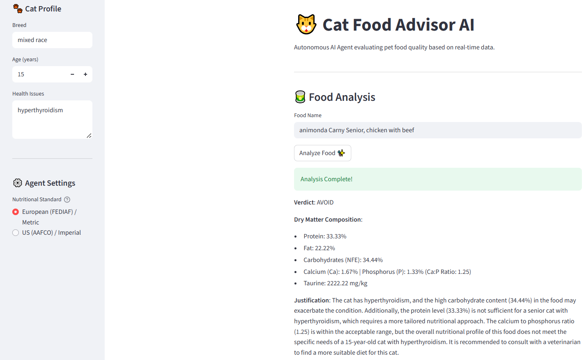

# 🐱 Cat Food Advisor AI - ReAct Agent



An autonomous AI Agent built with Streamlit that evaluates cat food quality based on professional veterinary standards (FEDIAF or AAFCO) using real-time web data.

## 🚀 Overview

Unlike standard chatbots, this advisor is a **ReAct Agent** with an interactive web UI. It autonomously:

1. **Searches** the web for real-time nutritional compositions (macronutrients and critical additives like Taurine).
2. **Calculates** precise Dry Matter (DM) values, Carbohydrate (NFE) content, and Calcium-to-Phosphorus (Ca:P) ratios using custom Python tools.
3. **Analyzes** the results against the specific health profile of the cat (age, breed, health issues).
4. **Delivers** a strict, medical-grade verdict (GOOD, ACCEPTABLE, or AVOID) in English, adhering to the user's chosen nutritional standard.

## 🛠️ Technology Stack

* **Frontend & App Framework:** Streamlit
* **AI Engine:** Groq (Llama 3.3 70B Versatile)
* **Search Tool:** DuckDuckGo Search API
* **Language:** Python 3.9+
* **Deployment:** Hugging Face Spaces (Docker)

## ⚙️ Key Features

* **Dual Standards:** Users can easily toggle between European (FEDIAF / Metric) and US (AAFCO / Imperial) veterinary guidelines.
* **Hallucination Protection:** All mathematical operations are entirely offloaded to isolated Python functions, ensuring the LLM never guesses percentages or ratios.
* **Strict Formatting:** Employs advanced prompt engineering to ensure the LLM strictly adheres to native JSON tool calling and outputs a perfectly formatted Markdown report.
* **Micro-Nutrient Tracking:** Specifically hunts for critical feline additives like Taurine, Calcium, and Phosphorus, alerting the user if vital data is missing.

## 💻 Local Setup

To run this AI Agent locally on your machine:

1. Clone the repository:
   ```bash
   git clone [https://github.com/YourUsername/CatFoodAdvisor.git](https://github.com/YourUsername/CatFoodAdvisor.git)
   cd CatFoodAdvisor
   ```

2. Install the required dependencies:
   ```bash
   pip install -r requirements.txt
   ```

3. Set your Groq API key as an environmental variable:
   ```bash
   # On macOS/Linux
   export GROQ_KEY='your_api_key_here'
   
   # On Windows (Command Prompt)
   set GROQ_KEY=your_api_key_here
   ```

4. Run the Streamlit application:
   ```bash
   streamlit run streamlit_app.py
   ```
